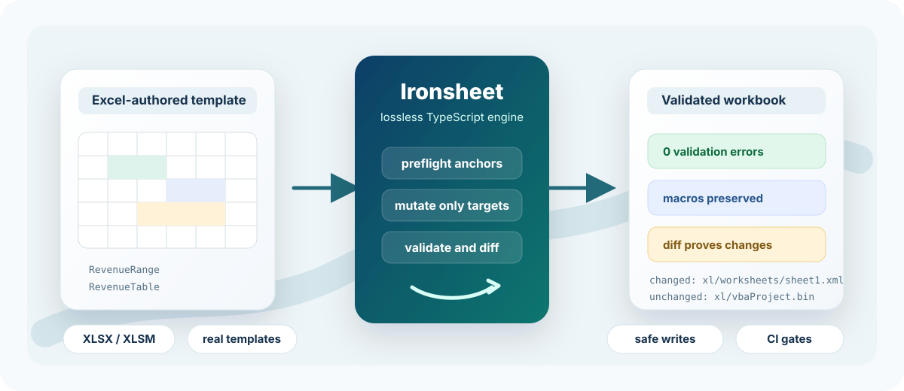
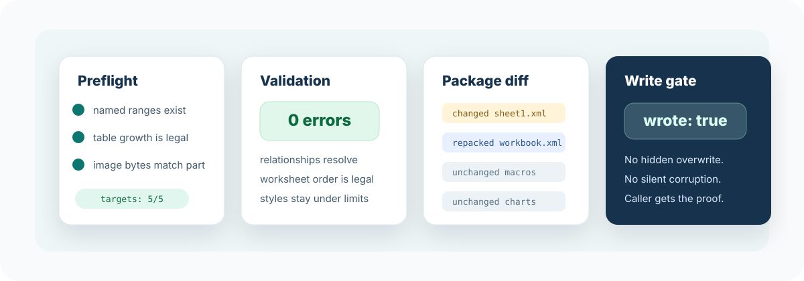

<p align="center">
  
</p>

<h1 align="center">Ironsheet</h1>

<p align="center">
  <strong>Move fast and break no spreadsheets.</strong>
</p>

<p align="center">
  The lossless TypeScript engine for editing real XLSX and XLSM files<br>
  without breaking formulas, styles, charts, pivots, macros, or layout.
</p>

<p align="center">
  <a href="docs/api.md"></a>
  
  
  
  
</p>

<p align="center">
  <a href="#quickstart">Quickstart</a>
  &nbsp;|&nbsp;
  <a href="#why-ironsheet">Why Ironsheet</a>
  &nbsp;|&nbsp;
  <a href="#packages">Packages</a>
  &nbsp;|&nbsp;
  <a href="#capabilities">Capabilities</a>
  &nbsp;|&nbsp;
  <a href="#development">Development</a>
</p>

<p align="center">
  
</p>

## The Promise

Edit Excel-authored workbooks as workbooks, not disposable data exports. Ironsheet patches only the cells, named ranges, tables, images, and metadata you target, validates the OOXML package, and returns a package diff that proves what changed before it writes.

Use it when the workbook is the product: finance models, board reports, operational dashboards, customer templates, macro-enabled flows, and spreadsheet experiences where a silent rewrite is unacceptable.

## Quickstart

Ironsheet 0.1 is an active MVP. For Node.js applications, install the safe-write adapter and start from an existing Excel-authored workbook:

```bash
npm install @ironsheet/node
```

Render a template safely:

```ts
import { renderWorkbookTemplateSafely } from "@ironsheet/node";

const report = await renderWorkbookTemplateSafely("template.xlsm", "output.xlsm", {
  names: [
    {
      name: "RevenueRange",
      values: [
        ["Region", "Amount"],
        ["North", 42000]
      ]
    }
  ],
  tables: [
    {
      tableName: "RevenueTable",
      rows: [
        ["North", 42000],
        ["South", 31500]
      ]
    }
  ],
  images: [
    {
      imagePartName: "xl/media/image1.png",
      data: await fetchLogoBytes()
    }
  ]
});

if (!report.wrote) {
  throw new Error(`Workbook failed validation: ${report.validation.summary.errors} error(s)`);
}

console.log(report.diff.summary);
```

Safe renders preflight every target before applying changes. If a named range, table, cell, range, or image is missing, Ironsheet fails before touching the workbook.

## Why Ironsheet

Most JavaScript spreadsheet libraries are optimized for creating workbook-shaped files from JavaScript objects. Ironsheet is optimized for guarded mutation of real Excel packages.

| Problem | Ironsheet behavior |
| --- | --- |
| A template has charts, styles, pivots, drawings, and macros you do not understand yet. | Untouched ZIP entries and unknown XML are preserved by default. |
| A report fill should update a named range and table without shifting layout. | Template rendering resolves anchors, validates resize plans, then applies one transaction. |
| A workbook edit could break formulas or leave stale calculation state. | Formula edits and dependent table/name edits mark workbooks for recalculation and remove stale calc-chain parts. |
| A CI job needs to know whether the output is structurally valid. | Safe writes return diagnostics, validation results, and content-vs-container package diffs. |
| An XLSM workbook contains macros that must survive generation. | Macro parts are preserved byte-for-byte unless a future explicit macro API touches them. |

<p align="center">
  
</p>

## Packages

| Package | Use it for |
| --- | --- |
| `@ironsheet/core` | Runtime-neutral workbook engine, ZIP/OPC/XML primitives, validators, and lossless mutation APIs. |
| `@ironsheet/node` | Node file IO, zlib compression, safe writes, and template render helpers. |
| `@ironsheet/browser` | Browser `Blob`, `File`, `ArrayBuffer`, `CompressionStream`, and `DecompressionStream` adapters. |
| `@ironsheet/cli` | JSON-first inspection, validation, preflight, diffing, and safe workbook mutation commands. |
| `@ironsheet/compat` | Compatibility corpus manifest and report types. |

The core engine is dependency-free and browser-compatible. Runtime-specific IO and compression live in adapters.

## API Shape

The stable path is intentionally boring:

```ts
import { mutateWorkbookFile } from "@ironsheet/node";

const report = await mutateWorkbookFile("template.xlsx", "report.xlsx", async (workbook) => {
  await workbook.patchCell("Summary", "B2", "Q1");
  await workbook.patchNamedRange("RevenueRange", [["North", 42000]]);
  await workbook.replaceTableRows("RevenueTable", [["North", 42000]]);
});

if (!report.wrote) {
  throw new Error("Ironsheet refused to write an invalid workbook");
}
```

Browser code uses the same workbook engine:

```ts
import { openWorkbookFromBlob, writeWorkbookToBlob } from "@ironsheet/browser";

const workbook = await openWorkbookFromBlob(file);
await workbook.patchCell("Sheet1", "B2", "Hello from the browser");

const output = await writeWorkbookToBlob(workbook);
```

Read the full [API guide](docs/api.md) for template rendering, low-level workbook methods, CLI contracts, validation rules, and compatibility gates.

## CLI

During repo development, run commands through `npm run cli -- ...`. Once installed as a package, the binary is `ironsheet`.

```bash
npm run cli -- inspect workbook.xlsx
npm run cli -- validate workbook.xlsx
npm run cli -- template-manifest template.xlsx
npm run cli -- preflight-template template.xlsx @patch.json
npm run cli -- render-template-safe template.xlsx output.xlsx @patch.json
npm run cli -- diff before.xlsx after.xlsx
```

Mutating CLI commands use safe writes by default. They print JSON reports and exit nonzero without writing the output file when validation errors are found.

## Capabilities

What works today:

- Parse and write OOXML ZIP packages with raw compressed payload preservation, duplicate path rejection, unsafe path rejection, CRC32, and ZIP64 metadata reads for in-memory archives.
- Preserve unknown workbook XML, styles, drawings, charts, pivots, comments, hyperlinks, merged cells, defined names, data validations, conditional formats, images, and XLSM macro parts.
- Inspect sheets, tables, named ranges, formulas, styles, images, comments, charts, pivots, relationships, content types, and package-level diagnostics.
- Patch cells, cell batches, ranges, named ranges, table rows, table columns, worksheet visibility, sheet names, table names, table column names, images, hyperlinks, merged cells, styles, filters, validations, and conditional formats.
- Author cell styles with deduplicated fonts, fills, borders, alignment, and number formats, for single cells or whole ranges without style explosion.
- Insert and delete rows with Excel-equivalent reference rewriting: formulas, defined names, merges, hyperlinks, validations, conditional formats, comment anchors, and tables below the edit all shift; dead references become `#REF!`.
- Add, copy, and delete worksheets with cascade part cleanup, scoped defined-name handling, and `#REF!` breaking for formulas that used a deleted sheet.
- Clear cells or ranges, with or without preserving formatting.
- Diff two workbooks semantically: cell-level adds/changes/removals plus sheet, defined-name, and table changes, alongside the package-level ZIP diff.
- Retarget formulas, defined names, chart formulas, and pivot-cache sources during supported sheet/table/column rename flows.
- Validate relationships, worksheet element order, dimensions, hyperlinks, merged cells, styles, shared strings, formulas, tables, pivots, charts, calc chains, defined names, and content types.
- Run a compatibility corpus with generated XLSX, XLSM, dashboard, pivot, large-sheet, cross-feature torture fixtures, plus optional Numbers, LibreOffice, Open XML SDK, and Excel checks.

Known boundaries:

- ZIP64 writing is not implemented yet; ZIP64 reading is metadata-only and still memory-backed.
- Chart and pivot support focuses on preservation, validation, and targeted retargeting, not full chart or pivot authoring.
- Ironsheet does not evaluate formulas. It preserves formulas, rewrites supported references, and marks the workbook for recalculation when needed.
- Some real-world Excel structures still need cleared corpus fixtures before they should be considered release-ready.

## Design Principles

- **Preserve first**: no broad workbook rewrite unless a target operation requires it.
- **Fail loudly**: unsupported structures should produce targeted errors or warnings, not corrupted output.
- **Prove the write**: every safe mutation returns validation and diff evidence.
- **Keep APIs narrow**: high-level template fills for normal users, low-level OOXML primitives for advanced users.
- **Stay portable**: runtime-neutral core, Node and browser adapters, TypeScript everywhere.

## Docs

- [API guide](docs/api.md)
- [Product research](docs/product-research.md)
- [Compatibility testing](docs/testing/compatibility.md)
- [Template fixtures](templates/README.md)
- [Changelog](CHANGELOG.md)

## Development

Use TypeScript for implementation, scripts, fixtures, and tests.

```bash
npm run verify
npm run ci
npm run build
npm run release:check
npm run release:check:strict
npm run brand:assets
```

Useful local workflows:

```bash
npm run templates:build
npm run browser:smoke
npm run compat:intake -- styled-table-report ~/fixtures/styled-table-report.xlsx --activate
npm run commit:safe -- "feat: add workbook capability"
```

`IRONSHEET_SPEC.md` is local planning material and is intentionally ignored.
